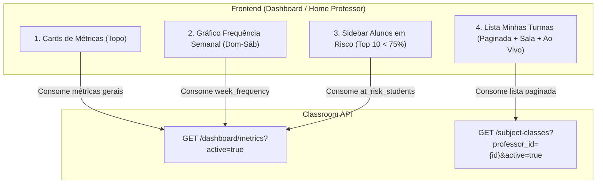

# 📊 Fluxo da Tela Inicial de Dashboards — Classroom API

Esta documentação detalha a arquitetura, endpoints, modelos de entrada (inputs) e saída (outputs) desenvolvidos para alimentar a **Tela Inicial de Dashboard do Professor e Administrador** (especificada no componente frontend [`home-professor.tsx`](file:///home/rodrigo/projects/classroom/classroom-web/src/components/dashboard/home-professor.tsx)).

---

## 📌 Visão Geral da Arquitetura

A tela inicial foi desenhada para carregar de forma extremamente performática, evitando o problema clássico de requisições em cascata (*N+1 round-trips*):



### Princípios Aplicados:
1. **Multi-tenancy Seguro via JWT**: O `tenant_id` não é passado na URL, sendo extraído diretamente da claim assinada no Bearer Token do usuário ativo.
2. **Escopo Dinâmico por Perfil (RBAC)**:
   - **`PROFESSOR`**: As métricas agregadas e turmas são filtradas estritamente pelas turmas que ele leciona.
   - **`ADMIN` / `COORDENADOR`**: As métricas agregadas englobam toda a instituição (tenant).
3. **Padrão Plano (Flat DTO)**: Em alinhamento com as melhores práticas de mercado para APIs de resumo/listagem, as entidades relacionadas trazem campos diretos (`room_id`, `room_name`, `professor_id`, `professor_name`), eliminando objetos redundantes ou aninhamentos desnecessários.
4. **Indicador de Chamada Ativa (*Live Status*)**: A listagem de turmas informa em sub-milissegundo se há uma chamada aberta agora (`has_active_session`) e o respectivo `active_session_id`.

---

## 🚀 Resumo das Rotas

| Seção da Tela | Método / Endpoint | Perfil Autorizado | Objetivo |
| :--- | :--- | :--- | :--- |
| **Métricas, Gráfico e Sidebar** | `GET /dashboard/metrics` | `ADMIN`, `PROFESSOR`, `COORDENADOR` | Retorna cards de contagem, alunos únicos, frequência 30d, alunos em risco, gráfico de 7 dias e top 10 piores frequências. |
| **Lista "Minhas Turmas"** | `GET /subject-classes` | Autenticado no Tenant | Lista paginada das turmas com nome da sala física, contagem de matrículas, taxa de presença e status ao vivo. |
| **Chamadas Abertas (Tempo Real)** | `GET /attendance-sessions/active` | `ADMIN`, `PROFESSOR`, `COORDENADOR` | Lista sessões de chamada que estão abertas e não expiradas no momento. |

---

## 1. `GET /dashboard/metrics` — Métricas Consolidadas

Retorna em **uma única chamada otimizada** todos os dados necessários para o topo do dashboard, o gráfico semanal e a barra lateral de alunos em risco.

### Requisição
* **Método**: `GET`
* **Caminho**: `/dashboard/metrics`
* **Autenticação**: `Bearer <access_token>` (Requer papel `ADMIN`, `PROFESSOR` ou `COORDENADOR`)

#### Query Parameters:
| Parâmetro | Tipo | Obrigatório | Padrão | Descrição |
| :--- | :--- | :--- | :--- | :--- |
| `active` | `boolean` | Não | `null` | Se `true`, considera apenas turmas ativas (`active=true`). Se `false`, apenas inativas. Se omitido, considera todas. |

### Regras de Negócio e Escopo:
1. **Filtro de Professor**: Se o usuário logado for `PROFESSOR`, o backend busca o vínculo `TenantMember` do usuário e restringe a consulta para `SubjectClassModel.professor_id == member.id`.
2. **Frequência dos Últimos 30 Dias**: Considera sessões não canceladas abertas nos últimos 30 dias (`opened_at >= NOW() - 30 days`).
   $$\text{Taxa Média} = \frac{\sum \text{Presenças Válidas (REGULAR/APPROVED)}}{\sum (\text{Alunos Ativos} \times \text{Sessões Válidas})}$$
3. **Semana Completa (Domingo a Sábado)**: Retorna 7 dias fixos da semana atual (da data atual para trás até o domingo correspondente e para frente até o sábado), calculando a presença agregada de cada dia.
4. **Alunos em Risco (< 75%)**:
   - `total_students_at_risk`: Contagem total de alunos matriculados com taxa de presença $< 75\%$ em turmas com pelo menos 1 sessão realizada.
   - `at_risk_students`: Retorna no máximo os **10 piores alunos** ordenados crescentemente pela taxa de presença, marcando `critical = true` para aqueles com frequência $\le 71\%$.

### Resposta de Sucesso (`200 OK`)

```json
{
  "total_classes": 5,
  "total_unique_students": 142,
  "average_attendance_rate": 0.885,
  "total_students_at_risk": 4,
  "week_frequency": [
    {
      "date": "2026-09-27",
      "day_of_week": 0,
      "label": "DOM",
      "attendance_rate": 0.0
    },
    {
      "date": "2026-09-28",
      "day_of_week": 1,
      "label": "SEG",
      "attendance_rate": 0.94
    },
    {
      "date": "2026-09-29",
      "day_of_week": 2,
      "label": "TER",
      "attendance_rate": 0.88
    },
    {
      "date": "2026-09-30",
      "day_of_week": 3,
      "label": "QUA",
      "attendance_rate": 0.91
    },
    {
      "date": "2026-10-01",
      "day_of_week": 4,
      "label": "QUI",
      "attendance_rate": 0.79
    },
    {
      "date": "2026-10-02",
      "day_of_week": 5,
      "label": "SEX",
      "attendance_rate": 0.0
    },
    {
      "date": "2026-10-03",
      "day_of_week": 6,
      "label": "SAB",
      "attendance_rate": 0.0
    }
  ],
  "at_risk_students": [
    {
      "student_id": "4b68e928-1b3c-42cb-b72e-c5339f4ad591",
      "student_name": "Lucas Mendes",
      "class_name": "Redes de Computadores",
      "absences": 6,
      "attendance_rate": 0.68,
      "critical": true
    },
    {
      "student_id": "8e31a89c-5f4a-4d32-bc55-e4d77b02c814",
      "student_name": "Camila Souza",
      "class_name": "Banco de Dados",
      "absences": 5,
      "attendance_rate": 0.71,
      "critical": true
    },
    {
      "student_id": "c1f76d91-3b74-4b55-a4dc-6f414e9188e2",
      "student_name": "Rafael Alves",
      "class_name": "Fábrica de Projetos",
      "absences": 5,
      "attendance_rate": 0.73,
      "critical": true
    },
    {
      "student_id": "f5a911d3-9bc4-4822-8321-df13b28b5e90",
      "student_name": "Joana Prado",
      "class_name": "Algoritmos e Estruturas de Dados",
      "absences": 4,
      "attendance_rate": 0.74,
      "critical": false
    }
  ]
}
```

---

## 2. `GET /subject-classes` — Lista "Minhas Turmas"

Retorna a lista paginada de turmas com todos os agregados necessários para a tabela/cards de turmas, incluindo o nome da sala física e o status de chamada ao vivo.

### Requisição
* **Método**: `GET`
* **Caminho**: `/subject-classes`
* **Autenticação**: `Bearer <access_token>`

#### Query Parameters:
| Parâmetro | Tipo | Obrigatório | Padrão | Descrição |
| :--- | :--- | :--- | :--- | :--- |
| `professor_id` | `UUID` | Não | `null` | Filtra por ID do professor (`tenant_members.id`). |
| `room_id` | `UUID` | Não | `null` | Filtra por ID da sala vinculada. |
| `search` | `string` | Não | `null` | Busca textual por nome da turma ou nome da disciplina. |
| `active` | `boolean` | Não | `null` | Filtra turmas ativas (`true`) ou inativas (`false`). |
| `page` | `integer` | Não | `1` | Número da página (1-indexado). |
| `page_size` | `integer` | Não | `20` | Quantidade de itens por página (máx. 100). |

### Resposta de Sucesso (`200 OK`)

```json
{
  "items": [
    {
      "id": "7b0a7019-35a1-4384-9dfa-c5ad6ec39d1b",
      "tenant_id": "a1b2c3d4-e5f6-7a8b-9c0d-1e2f3a4b5c6d",
      "professor_id": "f47ac10b-58cc-4372-a567-0e02b2c3d479",
      "professor_name": "Carlos Silva",
      "room_id": "e8a9310c-9a11-4702-8d75-bc26b215e982",
      "room_name": "Lab 204",
      "name": "T01",
      "discipline_name": "Algoritmos e Estruturas de Dados",
      "active": true,
      "student_count": 42,
      "attendance_rate": 0.94,
      "has_active_session": true,
      "active_session_id": "9c1b3f54-8c44-48e6-993d-82d1c6828551",
      "created_at": "2026-08-10T14:30:00Z",
      "updated_at": "2026-10-01T09:00:00Z"
    },
    {
      "id": "893c52e8-4678-4bfb-a63f-679951804f32",
      "tenant_id": "a1b2c3d4-e5f6-7a8b-9c0d-1e2f3a4b5c6d",
      "professor_id": "f47ac10b-58cc-4372-a567-0e02b2c3d479",
      "professor_name": "Carlos Silva",
      "room_id": "0df81e64-5390-482a-a9e3-ff946b2b73d2",
      "room_name": "Sala 12",
      "name": "T02",
      "discipline_name": "Banco de Dados",
      "active": true,
      "student_count": 38,
      "attendance_rate": 0.88,
      "has_active_session": false,
      "active_session_id": null,
      "created_at": "2026-08-10T15:00:00Z",
      "updated_at": "2026-09-28T18:00:00Z"
    }
  ],
  "total": 2,
  "page": 1,
  "page_size": 20,
  "total_pages": 1
}
```

---

## 3. `GET /attendance-sessions/active` — Chamadas Abertas (Tempo Real)

Rota auxiliar para verificar e monitorar todas as sessões de chamada que estão em andamento na instituição.

### Requisição
* **Método**: `GET`
* **Caminho**: `/attendance-sessions/active`
* **Autenticação**: `Bearer <access_token>` (Requer papel `ADMIN`, `PROFESSOR` ou `COORDENADOR`)

### Resposta de Sucesso (`200 OK`)

```json
[
  {
    "session_id": "9c1b3f54-8c44-48e6-993d-82d1c6828551",
    "subject_class_id": "7b0a7019-35a1-4384-9dfa-c5ad6ec39d1b",
    "class_name": "T01",
    "discipline_name": "Algoritmos e Estruturas de Dados",
    "room_id": "e8a9310c-9a11-4702-8d75-bc26b215e982",
    "room_name": "Lab 204",
    "day_code": "AED19",
    "opened_at": "2026-10-01T19:00:00Z",
    "expires_at": "2026-10-01T19:20:00Z",
    "remaining_seconds": 684,
    "total_students": 42,
    "confirmed_count": 39,
    "irregular_count": 1
  }
]
```

---

## 🎨 Guia de Integração com o Frontend (`home-professor.tsx`)

Abaixo está o mapa de correspondência entre as propriedades do componente React e as propriedades retornadas pela API:

### 1. Topo: Cards de Estatísticas
| Componente no Front | Campo na API (`GET /dashboard/metrics?active=true`) | Exemplo Visual |
| :--- | :--- | :--- |
| **Card 1: Turmas Ativas** | `total_classes` | `5` turmas no semestre |
| **Card 2: Alunos Únicos** | `total_unique_students` | `142` matrículas ativas |
| **Card 3: Freq. Média (30d)** | `average_attendance_rate * 100` | `88.5%` taxa média geral |
| **Card 4: Alunos em Risco** | `total_students_at_risk` | `4` alunos abaixo de 75% |

### 2. Gráfico: Frequência Semanal (`WeekFrequencyChart`)
- Consumir o array `week_frequency`:
  ```typescript
  week_frequency.map((day) => ({
    label: day.label, // "DOM", "SEG", "TER", ...
    pct: Math.round(day.attendance_rate * 100),
    isToday: day.date === todayIsoString,
  }))
  ```

### 3. Sidebar: Alunos em Risco (`AtRiskList`)
- Consumir o array `at_risk_students`:
  ```typescript
  at_risk_students.map((student) => ({
    name: student.student_name,
    classLabel: `${student.class_name} · ${student.absences} faltas`,
    attendancePct: Math.round(student.attendance_rate * 100),
    critical: student.critical, // se true -> badge vermelha; se false -> badge amarela
  }))
  ```

### 4. Tabela Central: Minhas Turmas (`ClassRow`)
- Consumir `items` de `GET /subject-classes?active=true`:
  ```typescript
  items.map((item) => ({
    id: item.id,
    name: item.discipline_name,
    subtitle: `${item.name} · ${item.room_name ?? "Sem sala"}`,
    students: item.student_count,
    attendance: Math.round(item.attendance_rate * 100),
    // Status para a badge:
    status: item.has_active_session ? "live" : "normal",
    activeSessionId: item.active_session_id,
  }))
  ```
- **Ação de Clique**: Se `item.has_active_session === true`, o clique na linha ou badge "AO VIVO" pode navegar diretamente para:
  `/turmas/${item.id}/chamadas/${item.active_session_id}`.
