# 🔐 Fluxo de Recuperação de Senha — Classroom API

Documentação técnica do fluxo de recuperação e redefinição de senha da **Classroom API**.

O sistema adota o padrão **Abordagem B (*Reset Token / Ticket Pattern*)**, considerado o padrão-ouro de segurança e arquitetura em plataformas de identidade modernas (Auth0, Okta, AWS Cognito, Stripe).

---

## 📌 Visão Geral da Arquitetura

O processo é dividido em **3 etapas desacopladas**:

1. **Solicitação do OTP**: O usuário informa o e-mail e recebe um código de 6 dígitos.
2. **Validação do OTP & Emissão de Ticket**: O código é validado e **destruído imediatamente**. A API emite um JWT temporário (`reset_token`).
3. **Redefinição da Senha**: O usuário define a nova senha apresentando o `reset_token`. O token é invalidado e todas as sessões ativas são revogadas.

```mermaid
sequenceDiagram
    autonumber
    actor User as Usuário (Frontend)
    participant API as Classroom API
    participant Redis as Redis Cache
    participant Resend as E-mail (Resend)
    participant DB as PostgreSQL

    %% Etapa 1
    Note over User, Resend: Etapa 1: Solicitação do Código
    User->>API: POST /auth/forgot-password { email }
    API->>DB: Busca usuário por e-mail
    alt Usuário não encontrado
        API-->>User: 200 OK (Mensagem genérica - Anti-enumeração)
    else Usuário encontrado
        API->>Redis: Salva OTP numérico (6 dígitos, TTL 15 min)
        API->>Resend: Envia e-mail com template HTML
        API-->>User: 200 OK (Mensagem genérica)
    end

    %% Etapa 2
    Note over User, Redis: Etapa 2: Validação & Emissão de Token
    User->>API: POST /auth/verify-reset-code { email, code }
    API->>Redis: Consulta chave password_reset:{email}
    alt Código incorreto
        API->>Redis: Incrementa tentativas (máx 5)
        alt Atingiu 5 tentativas
            API->>Redis: DELETA chave do Redis (Anti-força bruta)
            API-->>User: 400 Bad Request (Limite excedido)
        else Tentativas < 5
            API-->>User: 400 Bad Request (Código incorreto)
        end
    else Código correto
        API->>Redis: DELETA OTP imediatamente (Uso único)
        API->>API: Gera JWT reset_token (type: password_reset, exp: 10 min)
        API-->>User: 200 OK { reset_token, token_type, expires_in }
    end

    %% Etapa 3
    Note over User, DB: Etapa 3: Redefinição da Senha
    User->>API: POST /auth/reset-password { reset_token, new_password }
    API->>API: Valida assinatura, expiração e tipo do JWT
    API->>Redis: Verifica se JTI está na blacklist
    alt Token já utilizado ou expirado
        API-->>User: 400 Bad Request
    else Token válido
        API->>DB: Atualiza hash da nova senha (Argon2)
        API->>Redis: Adiciona JTI à blacklist (TTL restante)
        API->>Redis: Registra timestamp em user_revoked_before:{user_id}
        API-->>User: 200 OK (Senha redefinida com sucesso)
    end
```



---

## 🚀 Detalhamento das Etapas

### Etapa 1: Solicitação do Código OTP

O usuário informa seu e-mail para receber as instruções de recuperação.

* **Rota**: `POST /auth/forgot-password`
* **Rate Limit**: 3 requisições por minuto por IP.
* **Payload de Envio**:
  ```json
  {
    "email": "aluno@escola.com"
  }
  ```
* **Resposta de Sucesso (200 OK)**:
  ```json
  {
    "message": "Se o e-mail estiver cadastrado, você receberá um código de recuperação em instantes."
  }
  ```
* **Comportamentos de Segurança**:
  * **Anti-Enumeração de Contas**: Se o e-mail não existir na base, a API retorna exatamente o mesmo `status 200` e mensagem genérica, impedindo invasores de descobrirem e-mails cadastrados.
  * **Geração Criptográfica**: O código é gerado via `secrets.randbelow(1_000_000)` garantindo 6 dígitos imprevisíveis (ex: `749201`).
  * **TTL no Redis**: Armazenado em `password_reset:{email}` com expiração padrão de 15 minutos.

---

### Etapa 2: Validação do OTP e Emissão de Ticket

O usuário digita o código de 6 dígitos recebido.

* **Rota**: `POST /auth/verify-reset-code`
* **Rate Limit**: 10 requisições por minuto por IP.
* **Payload de Envio**:
  ```json
  {
    "email": "aluno@escola.com",
    "code": "749201"
  }
  ```
* **Resposta de Sucesso (200 OK)**:
  ```json
  {
    "reset_token": "eyJhbGciOiJIUzI1NiIsInR5cCI6IkpXVCJ9...",
    "token_type": "Bearer",
    "expires_in": 600
  }
  ```
* **Comportamentos de Segurança**:
  * **Destruição Imediata do OTP**: Assim que o código é validado, ele é removido do Redis. O código não pode ser reutilizado nem sofre vazamento posterior.
  * **Proteção Anti-Força Bruta**: O sistema permite até 5 tentativas incorretas. Na 5ª tentativa falha, a chave é sumariamente destruída e o usuário é obrigado a solicitar um novo código.
  * **Preservação de TTL no Erro**: Ao contabilizar tentativas falhas, o TTL original no Redis é mantido, impedindo que erros estendam artificialmente a validade do código.
  * **Ticket Temporário de Alta Entropia**: O `reset_token` gerado é um JWT assinado com chave secreta, contendo:
    * `sub`: ID do usuário.
    * `type`: `"password_reset"`.
    * `jti`: UUID exclusivo para rastreamento de uso único.
    * `exp`: 10 minutos (configurável via `settings.password_reset_token_expire_minutes`).

---

### Etapa 3: Redefinição de Senha e Revogação

O usuário define a nova senha utilizando o `reset_token` como autorização.

* **Rota**: `POST /auth/reset-password`
* **Rate Limit**: 5 requisições por minuto por IP.
* **Payload de Envio**:
  ```json
  {
    "reset_token": "eyJhbGciOiJIUzI1NiIsInR5cCI6IkpXVCJ9...",
    "new_password": "NovaSenhaForte@2026"
  }
  ```
* **Resposta de Sucesso (200 OK)**:
  ```json
  {
    "message": "Senha redefinida com sucesso. Faça login com suas novas credenciais."
  }
  ```
* **Comportamentos de Segurança**:
  * **Validação Estrita de Tipo**: Tokens normais de acesso (`type: "access"`) ou atualização (`type: "refresh"`) são rejeitados se passados para essa rota.
  * **Uso Único do Token (*Blacklist por JTI*)**: O identificador `jti` do token é adicionado à blacklist do Redis até a sua expiração. Qualquer tentativa de reutilizar o mesmo `reset_token` resulta em `400 Bad Request ("Token de recuperação já utilizado.")`.
  * **Validação de Tamanho da Senha**: Exige no mínimo 6 caracteres.
  * **Revogação Global de Sessões**: Todas as sessões anteriores (Mobile e Web), cookies e tokens de acesso emitidos antes desse momento são imediatamente invalidados via `revoke_user_sessions(user.id)`.

---

## 🗄️ Estrutura de Chaves no Redis

| Chave                             | Tipo                   | TTL Padrão                         | Finalidade                                                                                                                          |
| :-------------------------------- | :--------------------- | :---------------------------------- | :---------------------------------------------------------------------------------------------------------------------------------- |
| `password_reset:{email}`        | String (JSON)          | 15 min                              | Armazena`{ "code": "...", "user_id": "...", "attempts": 0 }`. Destruído ao validar com sucesso na etapa 2 ou ao atingir 5 erros. |
| `blacklist:{jti}`               | String (`"revoked"`) | Tempo restante do JWT (máx 10 min) | Garante que o`reset_token` só possa ser utilizado uma única vez.                                                                |
| `user_revoked_before:{user_id}` | String (Timestamp)     | 7 dias                              | Invalida todos os tokens emitidos antes do momento da troca da senha.                                                               |

---

## ⚙️ Configurações (`src/config/settings.py`)

```python
# Expiração do código OTP de 6 dígitos no Redis (Etapa 1 -> Etapa 2)
password_reset_expire_minutes: int = 15

# Expiração do JWT reset_token (Etapa 2 -> Etapa 3)
password_reset_token_expire_minutes: int = 10
```

---

## 📂 Mapeamento de Arquivos

| Camada              | Arquivo                                                          | Responsabilidade                                                             |
| :------------------ | :--------------------------------------------------------------- | :--------------------------------------------------------------------------- |
| **Config**    | `src/config/settings.py`                                       | Parâmetros de TTL de OTP e de Reset Token.                                  |
| **Security**  | `src/security/jwt.py`                                          | `create_reset_password_token` e `decode_reset_password_token`.           |
| **Security**  | `src/security/blacklist.py`                                    | Invalidação de sessões e controle de blacklist.                           |
| **Schemas**   | `src/modules/auth/interface/schemas/password_reset_schemas.py` | DTOs de requisição e resposta para as 3 rotas.                             |
| **Use Cases** | `src/modules/auth/application/use_cases/forgot_password.py`    | Geração de OTP e envio de e-mail.                                          |
| **Use Cases** | `src/modules/auth/application/use_cases/verify_reset_code.py`  | Validação de OTP, consumo no Redis e emissão do JWT.                      |
| **Use Cases** | `src/modules/auth/application/use_cases/reset_password.py`     | Validação do JWT, atualização de senha e revogação de sessões.        |
| **Router**    | `src/modules/auth/interface/router.py`                         | Endpoints`/forgot-password`, `/verify-reset-code` e `/reset-password`. |

---

## 🧪 Como Executar a Suíte de Testes

Os testes cobrem toda a funcionalidade em 3 níveis (Unitário, Integração e E2E):

```bash
# Rodar todos os testes de autenticação (Unitários + Integração + E2E)
uv run pytest tests/unit/modules/auth tests/integration/modules/auth tests/e2e/modules/auth

# Rodar apenas testes unitários de password reset
uv run pytest tests/unit/modules/auth/test_password_reset_use_cases.py

# Rodar testes de integração com PostgreSQL e Redis reais
uv run pytest tests/integration/modules/auth/test_password_reset_flow.py

# Rodar testes E2E das rotas HTTP
uv run pytest tests/e2e/modules/auth/test_password_reset_router.py
```
