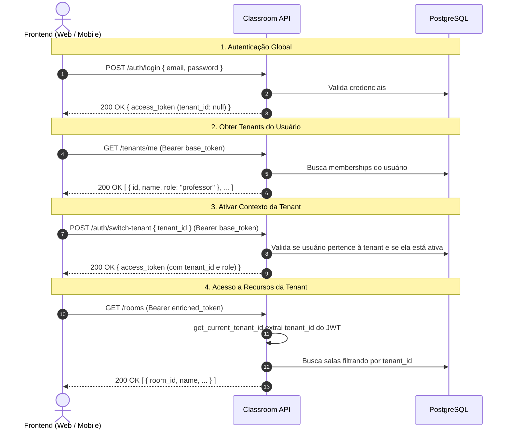

# 🏢 Contexto de Tenant e Roteamento — Classroom API

Esta documentação descreve a refatoração da arquitetura multi-tenant na **Classroom API**, detalhando a transição do modelo antigo (onde o `tenant_id` era exposto na URL) para o novo modelo seguro baseado em **Contexto de Autenticação via JWT e Injeção de Dependências**.

---

## 📌 Resumo da Mudança

| Aspecto | Modelo Anterior (Depreciado) | Novo Modelo (Atual) |
| :--- | :--- | :--- |
| **Origem do `tenant_id`** | Path Parameter na URL (`/tenants/{tenant_id}/...`) | Claim criptografada dentro do JWT (`ctx.tenant_id`) |
| **Resolução no Backend** | Parâmetro manual em cada rota: `tenant_id: UUID` | Injeção de dependência: `Depends(get_current_tenant_id)` |
| **Formato das URLs** | `/tenants/{tenant_id}/rooms` | `/rooms` |
| **Segurança contra IDOR** | Dependia de checagens manuais repetitivas em cada rota | **Impossível forjar** (assinado digitalmente no token) |
| **Papel do Usuário (Role)** | Role genérica global | Role dinâmica vinculada à instituição selecionada |

---

## 🎯 Motivações Arquiteturais e de Segurança

### 1. Eliminação de IDOR (*Insecure Direct Object Reference*) e *Tenant Hopping*
* **No modelo antigo**, um usuário mal-intencionado autenticado poderia alterar o UUID na URL (ex: de `/tenants/escola-a/rooms` para `/tenants/escola-b/rooms`). Se o desenvolvedor esquecesse de validar o vínculo do usuário com a tenant em uma única rota, haveria vazamento de dados (*data leak* multi-tenant).
* **No novo modelo**, o cliente não informa mais o `tenant_id` nas rotas de negócio. O servidor lê o identificador assinado com a chave secreta do JWT. O usuário só consegue agir na tenant para a qual obteve autorização explícita.

### 2. URLs RESTful Mais Limpas e Concisas
Em vez de URLs extensas e poluídas com múltiplos UUIDs aninhados:
```http
GET /tenants/3fa85f64-5717-4562-b3fc-2c963f66afa6/rooms/f47ac10b-58cc-4372-a567-0e02b2c3d479
```
A API agora expõe recursos limpos e diretos:
```http
GET /rooms/f47ac10b-58cc-4372-a567-0e02b2c3d479
```

### 3. RBAC Dinâmico por Tenant (*Role-Based Access Control*)
Em plataformas educacionais, um mesmo usuário pode desempenhar papéis diferentes dependendo da instituição:
* **Escola A**: Usuário é `PROFESSOR`.
* **Escola B**: Usuário é `STUDENT`.
* **Escola C**: Usuário é `ADMIN`.

Ao trocar para a tenant ativa via `/auth/switch-tenant`, o token emitido traz tanto o `tenant_id` ativo quanto a `role` correspondente do usuário naquela tenant específica.

---

## 🔄 Fluxo de Autenticação e Seleção de Tenant



### Detalhamento dos Passos:

1. **`POST /auth/login`**:
   * O usuário faz login com suas credenciais.
   * Recebe um token de acesso inicial onde `tenant_id` é `null` (ou o usuário pode ter uma tenant padrão selecionada se implementado).

2. **`GET /tenants/me`**:
   * O cliente consulta as instituições em que o usuário está matriculado ou vinculado.
   * Retorna os dados da instituição e a role que ele possui em cada uma.

3. **`POST /auth/switch-tenant`**:
   * O cliente escolhe a tenant ativa enviando:
     ```json
     {
       "tenant_id": "3fa85f64-5717-4562-b3fc-2c963f66afa6"
     }
     ```
   * O use case [SwitchTenantUseCase](file:///home/rodrigo/projects/classroom/classroom-api/src/modules/auth/application/use_cases/switch_tenant.py) valida se a tenant existe, se está ativa e se o usuário é membro dela.
   * Retorna um novo token JWT enriquecido:
     ```json
     {
       "sub": "user_uuid",
       "tenant_id": "3fa85f64-5717-4562-b3fc-2c963f66afa6",
       "role": "professor",
       "type": "access",
       "exp": 1727350000
     }
     ```

4. **Chamadas subsequentes às rotas de negócio**:
   * O frontend salva o token enriquecido e realiza chamadas para `/rooms`, `/subject-classes`, `/attendance`, etc.

---

## 🛠️ Como Funciona no Código (Backend)

### 1. Injeção da Tenant Ativa: `get_current_tenant_id`

Localizado em [`src/security/dependencies/current_user.py`](file:///home/rodrigo/projects/classroom/classroom-api/src/security/dependencies/current_user.py):

```python
async def get_current_tenant_id(
    ctx: AuthContext = Depends(get_auth_context),
) -> UUID:
    """Extrai o ID da tenant ativa do contexto de autenticação (JWT)."""
    if ctx.tenant_id is None:
        raise HTTPException(
            status_code=status.HTTP_403_FORBIDDEN,
            detail="Nenhuma tenant selecionada. Use POST /auth/switch-tenant.",
        )
    return ctx.tenant_id
```

Se o cliente tentar acessar uma rota protegida sem ter ativado uma tenant (ou com token base), a API responde automaticamente com `403 Forbidden`.

### 2. Controle de Permissões: `require_role`

Localizado em [`src/security/dependencies/require_role.py`](file:///home/rodrigo/projects/classroom/classroom-api/src/security/dependencies/require_role.py):

```python
def require_role(*roles: UserRole):
    """Exige contexto de tenant E que a role do usuário seja uma das permitidas."""

    async def dependency(ctx: AuthContext = Depends(get_auth_context)) -> AuthContext:
        if ctx.tenant_id is None:
            raise HTTPException(
                status_code=status.HTTP_403_FORBIDDEN,
                detail="Nenhuma tenant selecionada. Use POST /auth/switch-tenant.",
            )
        if ctx.role not in roles:
            raise HTTPException(
                status_code=status.HTTP_403_FORBIDDEN,
                detail="Acesso não autorizado para este perfil.",
            )
        return ctx

    return dependency
```

### 3. Exemplo Prático em um Router (`/rooms`)

Antes:
```python
# ❌ Modelo antigo (acoplado à rota)
@router.post("/tenants/{tenant_id}/rooms")
async def create_room(tenant_id: UUID, body: CreateRoomRequest): ...
```

Depois:
```python
# ✅ Novo modelo (limpo e desacoplado)
@router.post(
    "",
    response_model=RoomResponse,
    status_code=201,
    dependencies=[Depends(require_role(UserRole.ADMIN, UserRole.PROFESSOR))],
)
async def create_room(
    body: CreateRoomRequest,
    tenant_id: UUID = Depends(get_current_tenant_id),
    current_user: User = Depends(get_current_user),
    db: AsyncSession = Depends(get_db),
) -> RoomResponse: ...
```

---

## 📋 Mapeamento de Rotas Migradas

| Recurso | Rota Antiga | Nova Rota |
| :--- | :--- | :--- |
| **Salas** | `/tenants/{tenant_id}/rooms` | `/rooms` |
| **Turmas** | `/tenants/{tenant_id}/subject-classes` | `/subject-classes` |
| **Matrículas** | `/tenants/{tenant_id}/enrollments` | `/enrollments` |
| **Chamadas / Sessões** | `/tenants/{tenant_id}/attendance/sessions` | `/attendance/sessions` |
| **Confirmação de Presença** | `/tenants/{tenant_id}/attendance/confirmations` | `/attendance/confirmations` |
| **Relatórios** | `/tenants/{tenant_id}/reports` | `/reports` |
| **Notificações Push** | `/tenants/{tenant_id}/notifications` | `/notifications` |

> **Nota**: As rotas de administração de tenants em si (como convidar membros, criar nova instituição, ativar/desativar) continuam sob `/tenants` (ex: `POST /tenants`, `GET /tenants/me`, `POST /tenants/{tenant_id}/invites`), pois operam sobre a entidade Tenant diretamente.

---

## 📱 Guia de Integração para o Frontend

1. **Ao autenticar (`/auth/login`)**:
   * Guarde o token inicial.
   * Chame `GET /tenants/me`.
   * **Se o usuário tiver apenas 1 instituição**: faça imediatamente a chamada para `POST /auth/switch-tenant` e armazene o token enriquecido retornado.
   * **Se tiver múltiplas**: exiba a tela de seleção de instituição (*"Escolha a sua escola/universidade"*). Após a escolha do usuário, dispare `POST /auth/switch-tenant`.

2. **Interceptador HTTP (Axios / Fetch)**:
   * Envie o token enriquecido no cabeçalho `Authorization: Bearer <token>`.
   * Trate erros `403` com mensagem `"Nenhuma tenant selecionada..."`: caso ocorra, redirecione o usuário para a tela de seleção de instituição.
